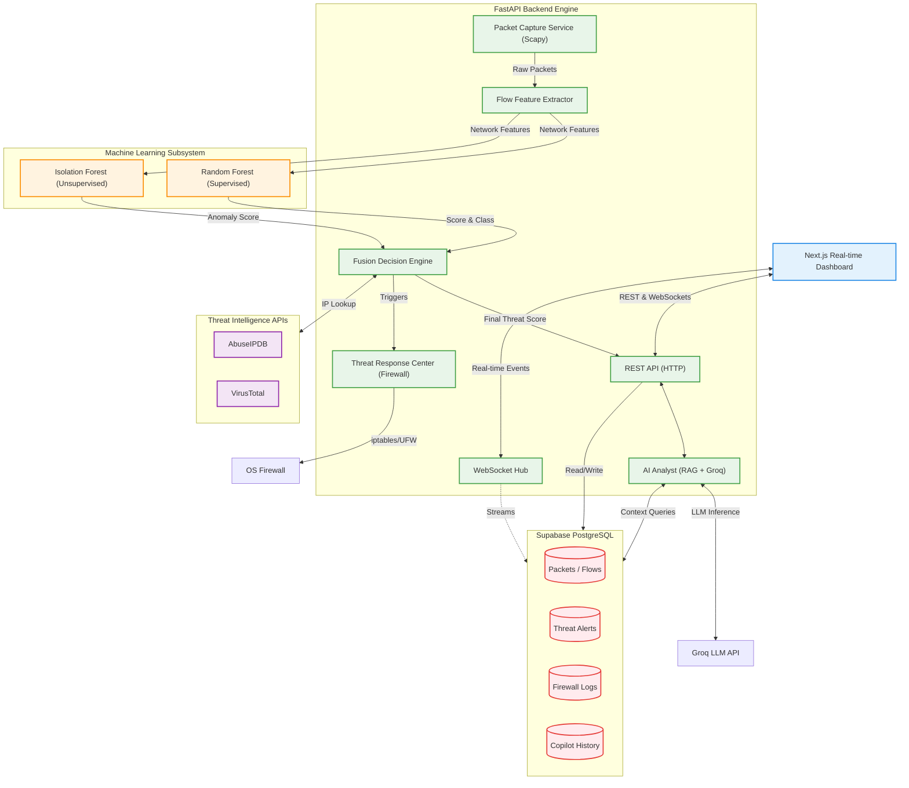

# CyberSentinel System Architecture

This document provides a high-level overview of the CyberSentinel architecture.

## System Architecture Diagram

## Architecture Decisions (FYP Defense Justification)

**1. Why FastAPI?**
FastAPI natively supports Python `asyncio`, which is critical for handling thousands of packets per second without blocking the main thread. It also auto-generates OpenAPI documentation and provides built-in WebSocket support for the real-time dashboard.

**2. Why Supabase / PostgreSQL?**
Instead of setting up a complex local database and dealing with connection pooling overhead, Supabase provides a managed, serverless PostgreSQL database with real-time subscriptions, making it perfect for a SOC dashboard that needs to update instantly when new threats are detected.

**3. Why Hybrid Machine Learning (Random Forest + Isolation Forest)?**
- **Random Forest** is supervised and excellent at detecting known attack signatures (like Port Scans, Brute Force) with high accuracy.
- **Isolation Forest** is unsupervised and detects zero-day anomalies that don't match known signatures.
- Combining them minimizes false negatives (missing an attack) and false positives (blocking legitimate traffic).

**4. Why an AI Copilot?**
Traditional dashboards leave the analyst to decipher raw data (e.g. "Rule 341 triggered"). Integrating an LLM with RAG (Retrieval-Augmented Generation) translates raw telemetry and threat scores into human-readable investigations, drastically reducing Mean Time To Respond (MTTR).
